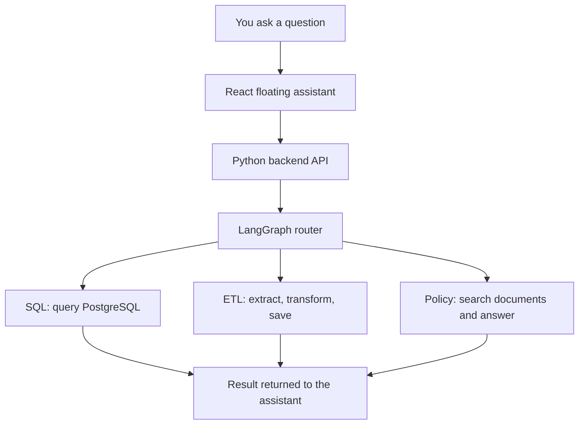

# Data Agent

Ask questions about your database, prepare datasets from external APIs, and find answers in company documents, all through one application.

## What does this project do?

Data Agent combines a React interface with a Python backend. Use the floating assistant to ask a question in plain English; the backend chooses the right specialist. You can also browse database tables, manage policy documents, and open saved ETL files from the sidebar.

This project is intended for **trusted, local development**. ETL can execute model-generated Python, and SQL safety checking uses a model. The polished interface does not make it a publicly secure service.

## Main capabilities

- **SQL:** Ask questions about business data in PostgreSQL, such as "How many users are registered?" The agent reads database context, generates and checks SQL, and explains the result.
- **ETL:** Extract data from supported external APIs, transform it, and preserve outputs as uniquely named files. ETL Files provides previews and downloads. The current extractor expects JSON records under a `results` key; CSV and JSON Lines work with the existing dependencies, while Parquet needs an optional engine.
- **Company Policy:** Upload TXT, Markdown, or text-based PDF documents and ask questions about company rules. The agent searches the documents, answers from retrieved evidence, and includes sources. When evidence is insufficient, it says so.

## How it works



The router chooses based on your request; you do not select an agent. Browsing tables and managing files use dedicated APIs directly.

## Technology

| Technology | Role |
| --- | --- |
| React, TypeScript, Vite | Browser interface and frontend development tools |
| Python, FastAPI | Backend logic and HTTP API |
| LangGraph, LangChain | Workflow routing and model/tool coordination |
| OpenAI, Anthropic | Language models; OpenAI also creates searchable text representations for Policy |
| PostgreSQL | Business records queried by SQL and displayed in data pages |
| pandas | ETL data extraction and transformation |
| Chroma, SQLite | Local Policy search storage and document/file metadata catalogs |
| uv | Python dependency and environment management |

## Quick Start

You need **Python 3.14**, **uv**, **Node.js 22.12+ with npm**, and a PostgreSQL database for SQL and data browsing. AI features require Anthropic and OpenAI credentials with access to the configured models. Chroma runs locally without a separate server.

**First, create your root `.env`** with `ANTHROPIC_API_KEY`, `OPENAI_API_KEY`, and the `DB_*` connection settings shown in [setup and configuration](docs/SETUP.md#environment-configuration). Use your own values; never commit credentials. The [setup guide](docs/SETUP.md#optional-sample-database) also explains the optional sample database.

From the repository root, start the backend:

```powershell
uv sync --locked
uv run uvicorn data_agent.api:app --host 127.0.0.1 --port 8000
```

In a second terminal, starting from the repository root:

```powershell
cd frontend
npm ci
npm run dev
```

Open **http://127.0.0.1:5173**. Keep both terminals running; press Ctrl+C in each to stop. The frontend forwards API requests to the backend automatically.

See [setup and troubleshooting](docs/SETUP.md) for environment variables, database preparation, storage locations, API URL configuration, and Windows command tips.

## Project Structure

```text
src/data_agent/   Python API, agents, and services
frontend/        React application and frontend tests
tests/           Backend tests
scripts/         Database and graph-generation utilities
data/            Sample CSV data and retained legacy outputs
docs/            Backend guides, setup, and references
artifacts/       Generated architecture diagrams
var/             Local generated storage (created when needed)
```

## Documentation

**Want to understand how the backend works?**

Start with [What happens when I ask the assistant a question?](docs/BACKEND_OVERVIEW.md), then explore the [documentation index](docs/README.md).

- [SQL Agent walkthrough](docs/SQL_AGENT.md)
- [ETL Agent and saved files](docs/ETL_AGENT.md)
- [Company Policy and document search (RAG)](docs/POLICY_AGENT.md)
- [Setup and development](docs/SETUP.md)
- [ETL Files and Policy API reference](docs/API_REFERENCE.md)

## Tests / Development

Backend tests, from the repository root:

```powershell
uv run python -m unittest discover -s tests -v
```

Frontend tests and production build, from `frontend/`:

```powershell
npm test
npm run build
```

The build includes TypeScript checking. No frontend lint script is configured. See [development commands](docs/SETUP.md#tests-and-development-commands) for additional checks and utilities. Tests with fake providers do not verify live model behavior.
