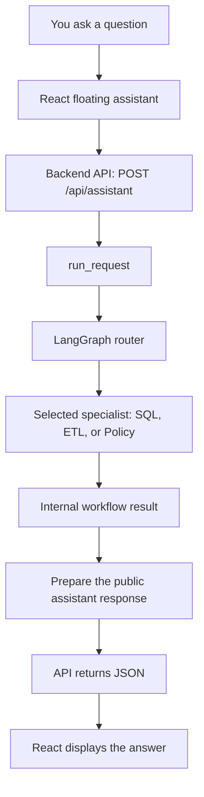
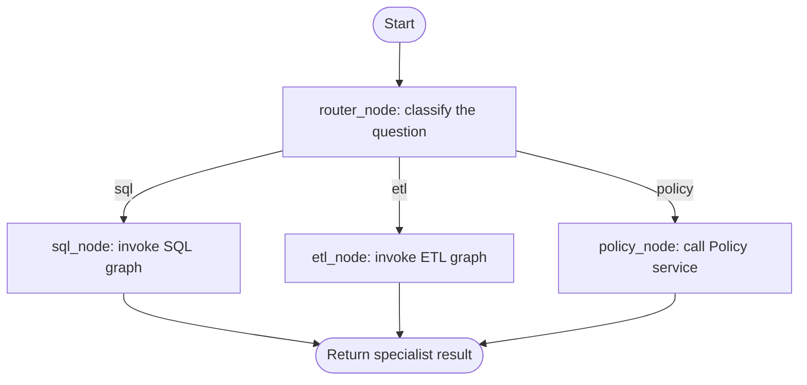

# What happens when I ask the assistant a question?

The browser sends your question to Python. Python chooses a specialist, runs its workflow, and sends an answer back. React displays that answer in the same floating assistant you used to ask the question.

You do not select SQL, ETL, or Policy yourself. The backend makes that choice.

This guide follows the current source code. It explains the request journey; it does not claim that a live provider or database was tested while writing it. For installation, see [setup and running](SETUP.md#requirements).

## 1. The big picture

The **frontend** is the React application in your browser. The **backend** is the Python application doing the work. An **API** is the agreed way they exchange requests and responses over HTTP.



JSON is a text format for named values. For example, the browser sends a question like this:

```json
{"question": "How many users are registered?"}
```

The model is only part of the system. Python code also validates input, calls tools, reads data, saves files, and prepares the response. In this project, an **agent** is a specialist workflow that combines model calls with those programmed steps.

The application is intended for trusted local use. A model's decision is not a substitute for database permissions or a sandbox for generated Python.

## 2. The router is the receptionist

Think of the Router like a receptionist. It receives your question, identifies the kind of help you need, and sends it to one specialist.

| Specialist | What it handles | Example intent |
| --- | --- | --- |
| SQL | Questions about business records in PostgreSQL | “Show employee payments this month.” |
| ETL | Extracting, transforming, or saving datasets | “Extract payments from an API and save CSV.” |
| Policy | Questions about company rules and uploaded documents | “What is our annual leave policy?” |

**SQL** is the language used to query the business database. **ETL** means Extract, Transform, Load; this application's ETL tools extract API data and transform/save files. **Policy** answers using the available company documents.

The router asks a language model to classify the question's intent. A language model, often called an **LLM**, is the AI model used to interpret or generate text. The router uses the project's Anthropic configuration through `create_llm("claude")`.

The model returns a structured decision with `answer` set to `sql`, `etl`, or `policy`, plus `comments`. Python then follows the matching route. This is not a keyword switch: “Show reimbursement payments” and “What does company policy say about reimbursements?” express different intentions. The instructions include examples, but model classification is not guaranteed to be correct.



This diagram summarizes the real router's nodes and branches. SQL and ETL have their own LangGraph workflows. Policy is an ordinary router node calling Python services; it does not have a separate Policy LangGraph graph.

Where to look: [router.py](../src/data_agent/agents/router.py), especially `ROUTING_INSTRUCTIONS`, `router_node()`, `route_edge()`, and `build_data_agent()`.

## 3. Follow one question from beginning to end

Suppose you ask **“How many users are registered?”** The following is the intended SQL path, assuming the router chooses SQL and the required services are available. The answer's number comes from the database; no example count is assumed here.

### Step 1: React collects your question

The floating assistant's form calls `submit()`. React shows a loading state and prevents another submission while this one is pending.

`askAssistant(question)` sends one POST request to the assistant API through the shared frontend service. The request contains the question, not a user-selected route or earlier conversation history.

Implementation: [AssistantProvider.tsx](../frontend/src/features/assistant/AssistantProvider.tsx) and [api.ts](../frontend/src/api.ts).

### Step 2: The API checks the input

The Python web framework, **FastAPI**, receives `POST /api/assistant`. The `AssistantRequest` model requires a nonblank string of at most 5,000 characters and rejects extra fields. Invalid input gets an error instead of entering the agent workflow.

For valid input, the handler calls the configured runner, which defaults to `run_request()`.

Implementation: [api.py](../src/data_agent/api.py), `create_app()` / `assistant()`, and [api_models.py](../src/data_agent/api_models.py), `AssistantRequest`.

### Step 3: Python starts the workflow

`run_request()` wraps the question in a `HumanMessage`. This is a Python object marking the text as a user's message. It starts the parent workflow with messages and an initially empty routing decision.

The central call looks like this:

```python
agent.invoke({
    "messages": [HumanMessage(content=question)],
    "route_response": "",
})
```

Here, `.invoke(...)` means “run this workflow with these starting values.” If no graph was supplied by the caller, `run_request()` constructs it with `build_data_agent()`. Constructing a graph arranges its steps; invoking it executes them.

Implementation: [main.py](../src/data_agent/main.py), `run_request()`.

### Step 4: The router delegates to SQL

`router_node()` asks the model for a routing decision and stores `sql` in `route_response`. `route_edge()` reads that value and chooses `sql_node()`.

`sql_node()` prepares the SQL workflow's starting fields and invokes its graph. The receptionist has now handed the work to the specialist.

Implementation: [router.py](../src/data_agent/agents/router.py).

### Step 5: The SQL specialist does the work

At overview level, the SQL workflow refines the question, obtains PostgreSQL schema/sample context, generates SQL, and asks a model to judge it. A “No” judgment produces a declined answer. A “Yes” judgment leads to database execution and preparation of a natural-language answer.

For this example, a successful result describes the actual registered-user count. The model's SQL judgment is an application step, not database-enforced read-only protection.

Implementation: [sql.py](../src/data_agent/agents/sql.py), `build_sql_graph()`, and [database.py](../src/data_agent/services/database.py), `DatabaseService`.

### Step 6: Python prepares a response for the browser

The SQL child returns its workflow result to the parent router. `run_request()` returns the internal parent result to the API.

The API does **not** send that whole notebook to React. `assistant_response()` selects and validates the public answer, route, and status. A successful SQL response has `route: "sql"` and `status: "answered"`; a model-judged refusal uses `status: "declined"`. Unusable results or exceptions follow the API's error handling.

Implementation: [assistant_response.py](../src/data_agent/services/assistant_response.py) and `AssistantResponse` in [api_models.py](../src/data_agent/api_models.py).

### Step 7: React shows the result

The shared API client checks the response shape. The assistant stores the response, ends the loading state, and displays the answer through its existing Markdown renderer. Errors appear in the same panel.

Implementation: [AssistantPanel.tsx](../frontend/src/features/assistant/AssistantPanel.tsx) and [AssistantMarkdown.tsx](../frontend/src/features/assistant/AssistantMarkdown.tsx).

## 4. LangGraph in everyday terms

LangGraph organizes the steps and decides what should run next. Start with these four ideas:

| Idea | Simple meaning | Example in this project |
| --- | --- | --- |
| Node | One work step | `router_node` classifies the question; `execute_sql` runs a query |
| Edge | A connection telling the workflow where to go next | The SQL workflow goes from `curate_ques` to `prompt_query_context` |
| State | The shared notebook that travels through a workflow | The router records `route_response`; SQL records `generated_sql_query` and `final_answer` |
| Conditional routing | Choose the next step using a value in the notebook | `route_edge()` reads `route_response` and chooses a specialist |

Some nodes call an LLM; others perform ordinary Python work. An edge is not a network request: it describes execution order.

### The shared notebook is structured

The notebook has named fields, rather than one large block of text. **Pydantic models** describe those fields and their expected types.

The parent and child workflows have different notebooks:

- `DataAgentSchema`: parent `messages` and `route_response`.
- `AgentSchema`: SQL question, generated query, safety decision, execution result, and final answer.
- `ETLAgentSchema`: messages, cached tool results, recorded ETL outcomes, and a later response-generation failure flag.

`RouterSchema` describes the model's classification response; it is not the whole parent state. Policy returns a `PolicyAnswer` object with its answer, status, and sources.

The parent receives each specialist's result through its own messages field. Internal graph state and public API response models serve different purposes.

Where to look: [state.py](../src/data_agent/agents/state.py) and [policy.py](../src/data_agent/agents/policy.py).

### Graph state is not persistent chat memory

Each assistant submission starts a fresh request. React preserves the visible draft, response, and pending request while you navigate or close the panel, but does not send a conversation history with the next question. Reloading the application resets that browser state.

Saved ETL files and indexed Policy documents are different: they persist in their storage locations across requests and restarts.

## 5. What changes for ETL and Policy?

The browser still uses the same assistant endpoint. Only the chosen specialist and the returned information change.

**ETL** uses a model/tool loop to extract or transform data. Successful managed writes produce file metadata. The response formatter uses recorded outcomes to describe success or failure and can include `files` and `etl_status`. A file attachment's ID comes from storage, not from parsing the model's prose. Saved files can survive a later summary-generation failure.

**Policy** searches indexed company-document chunks and uses retrieved evidence to prepare an answer with sources. This retrieve-then-answer approach is called **retrieval-augmented generation (RAG)**. Chroma searches vectors: numerical representations used to find relevant text. OpenAI supplies the embeddings and answer model through the shared configuration. When evidence is insufficient, the response says so and returns no sources.

PostgreSQL holds business records. Chroma holds Policy vectors. Separate local SQLite catalogs track Policy document lifecycle and ETL file history; neither replaces the business database.

These workflows have different meanings of success. In particular, the top-level `answered` status means a response was prepared; ETL's `etl_status` describes its recorded operation outcome. It is not a promise that model-generated transformations are correct.

## 6. A small map of the backend

```text
src/data_agent/
├── api.py                    Web API host and assistant endpoint
├── api_models.py             Public request/response shapes
├── policy_api.py             Company document management endpoints
├── etl_api.py                Saved-file list, details, preview, download
├── main.py                   run_request() and separate example CLI
├── __main__.py               Python package command entry
├── config.py                 Environment and storage settings
├── llm.py                    Shared model and embedding factories
├── agents/
│   ├── router.py             Choose and invoke one specialist
│   ├── sql.py                SQL graph
│   ├── etl.py                ETL graph
│   ├── etl_tools.py          ETL tool coordination
│   ├── policy.py             Grounded Policy answering service
│   └── state.py              Workflow and decision models
└── services/
    ├── assistant_response.py Convert internal results to public answers
    ├── database.py           PostgreSQL access for SQL workflow
    ├── table_browser.py      Independent, approved table browsing
    ├── extraction.py / transformation.py
    ├── etl_*.py              File storage, history, results and previews
    └── policy_*.py           Documents, ingestion, retrieval and vectors
```

- `agents/` coordinates the specialist workflows.
- `services/` performs focused operations such as querying storage or indexing a document.
- `frontend/` contains the browser interface and shared API client.
- `scripts/` contains explicitly run maintenance and diagram commands.
- `tests/` contains backend checks, including tests with fake providers.
- `var/` contains local runtime storage for Policy and ETL, not Python source.

Opening a Data page, previewing an ETL file, or managing a Policy document uses its dedicated API directly. Those actions do not all pass through the assistant router. Likewise, the example CLI in `main.py` is separate from the web request path and prints internal graph output.

## 7. Existing diagrams and next reading

The Mermaid diagrams above explain the request journey. For generated node diagrams, see the existing [router](../artifacts/graphs/data_agent_graph.png), [SQL](../artifacts/graphs/sql_analyst_graph.png), and [ETL](../artifacts/graphs/etl_analyst_graph.png) PNGs.

[generate_graphs.py](../scripts/generate_graphs.py) uses the real graph builders to render those files. It does not create a separate Policy graph.

Return to the [documentation index](README.md), or follow [running the application](SETUP.md#install-and-start). Specialist internals can be studied later; understanding the shared request journey is enough to start navigating this backend.
