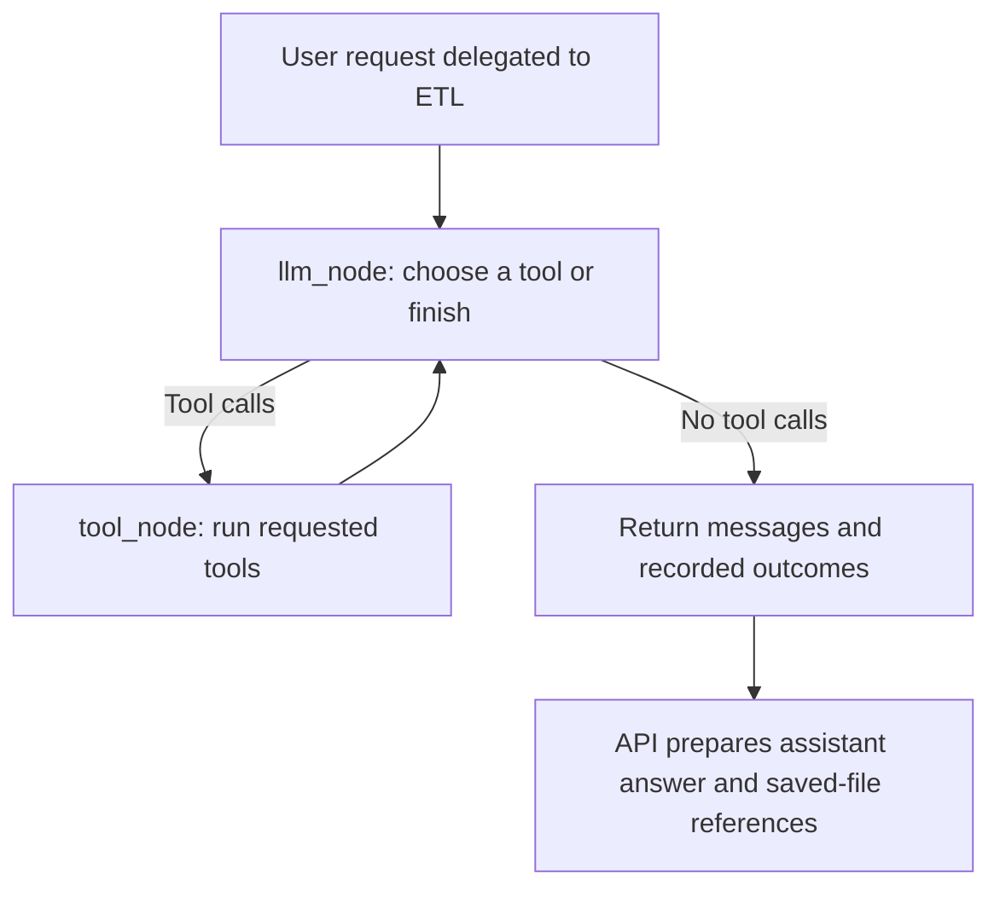

# ETL Agent: from an external API to saved files

**ETL = Extract → Transform → Load.**

In plain English: fetch data, reshape it if needed, and save the result. In this application, "load" means writing an output file; these tools do not load the extracted records into PostgreSQL.

For example, you might ask: **"Get customer/order data from this external API, save CSV, and create a transformed CSV containing the fields I need."** Include the real API URL and the transformation you want.

This guide explains the current implementation. It does not assume that every external API is supported or that an extraction always needs a transformation. See the [backend overview](BACKEND_OVERVIEW.md) for the shared assistant request path.

## 1. The router chooses ETL

The floating assistant sends the question to `POST /api/assistant`. `run_request()` starts the parent workflow. Its router classifies extraction, transformation, and dataset-saving intentions as `etl` and delegates through `etl_node()`.

That node invokes the ETL child graph with the user's message. There is no separate ETL chatbot or user-selected agent switch.

Implementation: [router.py](../src/data_agent/agents/router.py) and [main.py](../src/data_agent/main.py).

## 2. The model chooses tools

A tool is a Python function the model can request the application to run. Here, the model can request `extract_load_tool` or `transform_load_tool`.

The actual graph has two nodes, rather than a fixed node for each letter in ETL:



`llm_node()` uses `create_llm("claude")` with the tools attached. `tool_node()` executes the requested tools, records their results, and returns those observations to the model. A request can involve extraction alone, transformation alone, or several operations.

Tool results have a readable message and a structured **artifact**: a Python record of what was saved or what failed. These records let the API distinguish storage-confirmed success from model-generated prose.

Within one graph execution, repeated extraction calls with the same URL and format reuse a cached result, even if the suggested name changes. Transformation calls reuse results when the tool name and arguments match. This is not a cache shared across separate user requests.

Implementation: [etl.py](../src/data_agent/agents/etl.py), `build_etl_graph()`, and [state.py](../src/data_agent/agents/state.py), `ETLAgentSchema`.

## 3. Extract: fetch API records

`extract_load_tool()` delegates to `extract_load()` in [extraction.py](../src/data_agent/services/extraction.py). It makes an HTTP GET request with `requests.get(url)`, checks the HTTP status, and parses the response as JSON.

The current extractor specifically reads `data["results"]`. It is not a general adapter for every API response shape. For example, this illustrative shape matches that expectation:

```json
{"results": [{"customer_id": 1, "order_count": 2}]}
```

These values only illustrate the input shape; they are not application records. A top-level array or a response using a different key needs an adapter that is not implemented here.

`pandas.json_normalize()` turns the records into a table in memory, called a **DataFrame**. The extractor saves that table through `ETLFileStore`. Its row count is known from the DataFrame and recorded with the output.

The current GET call has no explicit timeout, pagination loop, or configurable authentication-header argument. Extraction is synchronous and loads the response into memory. Closing the assistant panel does not cancel it.

## 4. Transform: reshape a saved dataset

If transformation is requested, `transform_load_tool()` reads a saved input file. `transform_load_context()` loads CSV, JSON Lines, or Parquet with pandas and supplies the first three rows as model context. It reads the dataset before selecting those sample rows; this is not a bounded preview reader.

The transformation prompt asks the model for pandas code based on the request, input path, and sample rows. It gives the model an exact staging output filename and tells it not to modify the input. `execute_code()` runs the generated Python using `exec()`.

The model is therefore generating executable code, not choosing from a fixed list of safe transformations. There is no sandbox around that code. Use trusted development data and requests; the prompt's instructions are not an enforced filesystem security boundary.

The managed output uses a stem based on the first 40 characters of the input filename stem plus `_transformed`. Its row count is currently left unknown rather than guessed. Extraction and transformation can each save an output, so one request may legitimately create two distinct files.

Implementation: [etl_tools.py](../src/data_agent/agents/etl_tools.py), `transform_result()` / `generate_and_execute()`, and [transformation.py](../src/data_agent/services/transformation.py).

## 5. Load: save a completed output

The supported output formats are:

| Format | What the current tools write | In-app preview |
| --- | --- | --- |
| CSV | A table, with extraction omitting the pandas row index | Columns and bounded rows |
| JSON | Extraction writes JSON Lines: one record per line, despite the `.json` extension; transformation is instructed to do the same | Bounded formatted JSON/JSON Lines |
| Parquet | A binary table format written through pandas and an available Parquet engine | Not supported; download the original |

Transformation output is produced by generated code. A saved file confirms publication, not that its contents or transformation are correct.

### Where files live

The default layout is:

```text
var/etl/
├── metadata.sqlite3   File-history catalog
└── outputs/           Completed output files
    └── .staging/      Temporary writes
```

`ETL_STORAGE_ROOT` changes the `var/etl` location. A relative setting is resolved against the application's data root; `outputs/` is appended. In a recognized checkout the data root is the repository root; the installed fallback uses the working directory. The tools' legacy `output_folder` argument does not choose the managed destination.

See [config.py](../src/data_agent/config.py), `default_data_root()` and `etl_output_path()`.

### Why filenames are unique

Repeatedly writing `customers.csv` would lose the previous extraction. Instead, Python builds each final name using:

```text
<descriptive_stem>_<YYYYMMDD_HHMMSS_microsecondsZ>_<16-hex-ID>.<format>
```

The timestamp is UTC. The ID is the first 16 hexadecimal characters of a new UUID and is also the file's stable catalog ID.

For extraction, the existing tool call may supply a short `filename_stem`; there is no extra paid naming call. Python normalizes it to lowercase ASCII letters, digits, and underscores, with a 64-character limit. Suggestions containing path syntax are discarded. It handles reserved Windows names too.

If the suggestion is absent or unusable, the fallback uses the source URL's last path segment, then its hostname, then `dataset`. Python controls the directory, timestamp, identifier, and format extension.

### Publication and metadata

`ETLFileStore.write()` writes into `.staging`, flushes the completed file to storage with `fsync`, and publishes it with `os.link()`. This same-filesystem hard link fails if the target exists instead of overwriting it. A collision triggers another ID attempt, up to ten attempts. The temporary name is then removed.

After publication, `ETLHistory.insert()` records the actual filename, ID, UTC creation time, byte size, display name, format, and known row count. The internal storage reference is a filename, not a browser-supplied path. Source metadata keeps only the hostname; source URL, description, and run ID are currently unset.

If metadata insertion fails, the store attempts to remove the newly published output and reports failure. If cleanup also fails, an unregistered file may require manual attention. Filesystem publication and SQLite insertion are not one crash-proof transaction. The normal success path returns only after both succeed.

Only completed outputs enter the catalog as `ready`. Files and catalog persist across restarts. Existing unregistered files are not automatically imported.

Implementation: [etl_files.py](../src/data_agent/services/etl_files.py) and [etl_history.py](../src/data_agent/services/etl_history.py).

## 6. Find, preview, and download the result

Open **ETL Files** in the sidebar at `/etl/files`. The page lists registered outputs newest first, 50 per page. It refreshes when opened, when you press Refresh files, or when the assistant reports new saved files. There is no polling loop.

Open / Preview uses the shared preview panel. Assistant attachments link to `/etl/files/:fileId`, which uses the same panel. These reads do not repeat extraction or call the ETL model.

The backend uses these read-only endpoints:

| Endpoint | Purpose |
| --- | --- |
| `GET /api/etl/files` | Paginated history |
| `GET /api/etl/files/{file_id}` | Safe metadata |
| `GET /api/etl/files/{file_id}/preview` | Bounded content preview |
| `GET /api/etl/files/{file_id}/download` | Original file bytes and generated filename |

CSV previews show at most 50 rows and 100 columns, with cell-length limits. Preview input is capped at 256 KiB. JSON objects, arrays, and JSON Lines are supported with additional depth, item, and text limits; a prefix of a large JSON file is explicitly marked unvalidated. A preview is not validation of the whole file.

Downloads stream the original bytes rather than regenerating the dataset. The frontend checks metadata first, then hands the download to the browser. Failures after that handoff belong to the browser's download handling.

The service resolves a stable ID through the catalog and validates the filename relationship, location, file type, and size. Missing or changed files get unavailable/error handling. Public metadata excludes internal paths and source credentials. These checks do not constitute a content checksum.

Implementation: [etl_api.py](../src/data_agent/etl_api.py), [etl_browser.py](../src/data_agent/services/etl_browser.py), [ETLFilesPage.tsx](../frontend/src/pages/ETLFilesPage.tsx), and [ETLPreviewPanel.tsx](../frontend/src/features/etl/ETLPreviewPanel.tsx).

## 7. Return an honest assistant response

[assistant_response.py](../src/data_agent/services/assistant_response.py) builds the completion message from recorded tool outcomes. Saved-file entries include the real ID, filename, format, creation timestamp, size, and row count when known. React renders the normal Markdown answer and file attachments with Open and Download actions.

The public `etl_status` distinguishes `completed`, `partial`, `failed`, and `response_failed`. A top-level `status: "answered"` means the API prepared a response; it does not mean every ETL operation succeeded.

Extraction, transformation, unsupported-format, and storage failures have separate recorded outcomes. If extraction saves a file but transformation fails, the saved extraction remains available and the response reports partial success.

If a later model response fails after tool outcomes were recorded, the graph preserves those outcomes and the API produces a deterministic response. It does not rerun extraction just to obtain a summary. If no tool outcomes exist, a model-only completion is not storage-confirmed success; the assistant displays an experimental-response notice without generated-file attachments.

The frontend does not automatically retry assistant POST requests. On an uncertain timeout or network failure, check ETL Files before submitting the extraction again.

## Related reading

See the [generated ETL graph](../artifacts/graphs/etl_analyst_graph.png), the [SQL Agent guide](SQL_AGENT.md), and the [documentation index](README.md). This guide describes source behavior; it does not claim a live API or provider test was performed while writing it.
