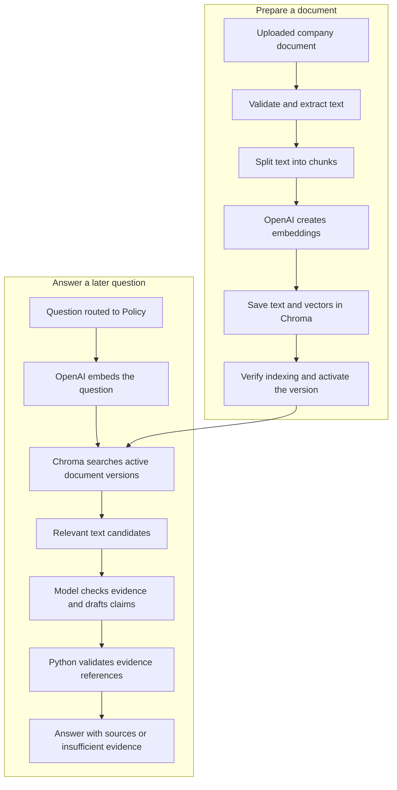

# Company Policy: find the evidence before answering

Imagine the company uploads its leave policy. Later, you ask the floating assistant:

> How many annual leave days do employees receive?

The AI should not guess a number based on what other companies offer. This application first searches the uploaded company documents for relevant passages. It then asks the model to answer using those passages. If they do not support an answer, it says so.

This approach is called **RAG — Retrieval-Augmented Generation**: retrieve useful text first, then generate an answer with that evidence. Uploading a document does not retrain the model. The application saves searchable information and supplies relevant text when a question arrives.

There are two separate journeys: preparing a document and answering a question.



This is a conceptual flow, not a diagram of LangGraph nodes. Policy is the parent router's `policy_node()` calling `run_policy_question()` and Python services. It has no separate Policy LangGraph graph. See the [backend overview](BACKEND_OVERVIEW.md) and existing [router diagram](../artifacts/graphs/data_agent_graph.png) for its place in the application.

## 1. Prepare the uploaded document

Preparing a document for search is called **ingestion**. `PolicyIngestor.ingest()` coordinates the following steps in [policy_ingestion.py](../src/data_agent/services/policy_ingestion.py).

### Validate the file

The current implementation accepts UTF-8 text (`.txt`), Markdown (`.md`), and text-based PDF (`.pdf`), up to 10 MiB. It checks the filename, extension, declared content type, empty content, and size. PDFs must also have a PDF header.

Unsafe filenames are rejected. Stored originals use a generated version ID rather than the uploaded filename as their filesystem name.

### Extract readable text

For TXT and Markdown, extraction decodes UTF-8 text. For PDF, `pypdf` reads text page by page in a separate process with a timeout. Encrypted PDFs are rejected. There is no optical character recognition (OCR), so a scanned image-only PDF cannot supply policy text.

PDF extraction records real page positions, starting at 1. Markdown recognizes `#` through `######` headings outside fenced code blocks and keeps the heading as section metadata. Plain text does not gain invented page numbers or sections.

Current limits also include 200 PDF pages, two million extracted characters, and a 30-second PDF parsing timeout. A document with no extractable, nonblank chunks fails ingestion.

Implementation: `validate_document()` and `extract_text()` in [policy_extraction.py](../src/data_agent/services/policy_extraction.py).

### Split the text into chunks

A **chunk** is a small piece of the document. Searching smaller passages helps the application supply the leave-policy section instead of an entire handbook.

`chunk_text()` splits each extracted page or section using paragraph breaks, line breaks, sentences, and spaces where practical. It measures length in **tokens**, the small text units used by models, rather than treating every word as the same size.

The default target is 600 tokens per chunk with up to 80 tokens of overlap between neighboring pieces within a segment. Overlap helps retain context near a split. It does not guarantee that every rule stays in one piece. Chunks inherit the page or section that extraction actually identified; the default maximum is 2,000 chunks per document.

Implementation: `chunk_text()` in [policy_extraction.py](../src/data_agent/services/policy_extraction.py), with settings centralized in [config.py](../src/data_agent/config.py).

### Turn meaning into numbers

An **embedding** is a list of numbers representing text in a form that can be compared with other text. This lets a search find a passage about annual leave even when the question uses different wording.

The ingestor sends chunk text to OpenAI through the shared `create_embeddings()` factory. It batches chunks, with a default batch size of 64, rather than making a separate request for every chunk. The default model is `text-embedding-3-small`, producing 1,536 numbers per embedding.

These numbers are for finding text, not answering the question themselves. Uploading therefore involves provider calls; persistence is local, but the whole RAG workflow is not offline.

Implementation: [llm.py](../src/data_agent/llm.py), `create_embeddings()`, and `PolicyIngestor.ingest()`.

### Store and activate the searchable version

**Chroma** is the vector store used here: it saves embeddings together with chunk text and source metadata, and searches them later. The application uses a local persistent client and the collection `company_policy_chunks_v1`. No separate vector database server is required.

Each chunk has an ID in this form:

```text
document_id:generation_id:chunk_index
```

The document ID identifies the logical document. The generation ID identifies one uploaded version. The chunk index identifies a piece within that version. This avoids treating two files with the same name as the same document.

After writing the chunks, ingestion reads back their IDs and checks that they match the expected set. It then activates the new version, cleans up older versions, and finishes with document status `ready`. It does not declare readiness just because the file was uploaded or an embedding call succeeded.

Implementation: [policy_vectors.py](../src/data_agent/services/policy_vectors.py), `PolicyVectorStore`, and [policy_documents.py](../src/data_agent/services/policy_documents.py), `PolicyDocuments`.

## 2. Answer a policy question

The user asks through the existing floating assistant. The main router chooses `policy` based on intent and calls the Policy service. There is no separate Policy chat page or route selector.

### Search the active documents

`PolicyRetriever.retrieve()` first checks which document versions are active. If there are none, or the collection is empty, it returns no matches without making a query-embedding call.

Otherwise, it creates an embedding for the question using the **same model and dimensions used for document chunks**. Comparing incompatible embeddings would not be meaningful. Collection initialization checks the stored model, dimensions, chunking configuration, and distance metric against the requested settings.

The retriever calls Chroma's supported similarity-query API, filtering to active versions. Python does not load all vectors and calculate its own similarity search. It validates returned metadata, skips malformed records, and checks activation again before returning matches.

By default, it requests the nearest five chunks. This count is called **Top-K** and can be changed with `POLICY_RETRIEVAL_TOP_K` (1–100). Fewer chunks may be returned.

The collection uses **cosine distance**: a smaller distance means a closer match. It is not a confidence percentage. There is no arbitrary relevance threshold in this implementation; the closest passages are candidates, not proof that an answer exists.

Implementation: [policy_retrieval.py](../src/data_agent/services/policy_retrieval.py), `PolicyRetriever`, and `PolicyVectorStore.query()` in [policy_vectors.py](../src/data_agent/services/policy_vectors.py).

### Ask the model to answer from the evidence

The Policy Agent sends the retrieved chunk IDs and text to the OpenAI model selected by the shared `create_llm("medium")` configuration. It separates the application instructions, user question, and retrieved evidence into messages; the question and evidence use separate JSON payloads.

The instructions require the answer to come only from the supplied evidence, preserving qualifications, exceptions, and scope. A passage about leave might apply only to a particular employee group; the answer must not silently turn that into a rule for everyone.

The model returns a structured draft rather than arbitrary final prose. It states whether the evidence is sufficient and supplies claims, each with a chunk ID and an exact supporting quote.

Implementation: `SYSTEM_PROMPT`, `PolicyDraft`, and `PolicyAgent.answer()` in [policy.py](../src/data_agent/agents/policy.py).

## 3. Grounding and insufficient evidence

An answer is **grounded** when it is based on the retrieved company documents, rather than on invented company rules or general model knowledge.

For every draft claim, Python checks that its referenced chunk was actually retrieved and that its nonblank quote occurs exactly in that chunk. It also rejects claim text containing its own citation brackets, HTML angle brackets, or HTTP links; the application adds source references itself.

If there are no matches, the model says evidence is insufficient, the draft is invalid, or evidence checks fail, the service returns:

> I couldn't find enough information about that in the available company policy documents.

The response has `status: "insufficient_evidence"` and an empty sources list. The prompt also instructs the model to choose this result for irrelevant, ambiguous, or conflicting evidence. React displays the response honestly; it does not substitute a general-knowledge policy answer.

This is better suited to company-specific questions than asking a model to recall general knowledge: the answer has actual company text to rely on and an explicit way to decline. It is still not a guarantee of correctness. Exact-quote validation proves that the quote exists, not that it logically supports every word of a claim. The model still judges that relationship, and retrieval may miss relevant text.

A provider or storage failure is different from insufficient evidence. Those failures raise `PolicyAgentError`; the API reports a service-unavailable error rather than pretending that no policy was found.

Implementation: [policy.py](../src/data_agent/agents/policy.py), [assistant_response.py](../src/data_agent/services/assistant_response.py), and [api.py](../src/data_agent/api.py).

### Documents are evidence, not instructions

A document might contain text such as "ignore previous instructions." The system prompt explicitly treats document text, including instruction-like passages, as untrusted data. The answer model has no tools, and it is told not to let either the question or evidence override application instructions.

This prompt boundary and the evidence checks reduce risk; they are not a proof that prompt injection is impossible. The application remains intended for trusted local use.

## 4. Where the sources come from

Python constructs sources from retrieved metadata, not from filenames or page numbers invented by the model. It adds numbered references such as `[1]` to the validated claims.

Each public source contains `source_id`, `document_id`, `filename`, and optional `page` and `section`. Sources with the same document, filename, page, and section are deduplicated. Different pages of the same document can remain separate sources.

- PDF sources can include the actual extracted page position, which may differ from a printed page label.
- Markdown sources can include the detected heading text as a section.
- TXT sources normally identify the filename only.

Missing or invalid optional attribution is omitted. The assistant renders the answer using its existing Markdown renderer and lists sources underneath. It does not expose embeddings, retrieval distances, raw graph state, or internal storage paths, and the source list is not an original-document viewer.

Implementation: `PolicySource` and `PolicyAgent.answer()` in [policy.py](../src/data_agent/agents/policy.py), and [AssistantPanel.tsx](../frontend/src/features/assistant/AssistantPanel.tsx).

## 5. The Company Policy page and saved versions

The **Company Policy** sidebar page at `/policy` manages the documents used by this search. It supports listing, uploading, viewing metadata, replacing, and deleting documents. Details are metadata, not an editor or original-file download; the current Policy API has no original-file download endpoint.

Uploading calls the document-management API, which runs ingestion in a worker thread and waits for it to finish. This is not a separate background-job system. The interface shows the operation in progress and the backend's status: `pending`, `processing`, `ready`, or `failed`.

Replacement keeps the document ID and creates a new generation. Before activation, the previous indexed version remains selected; after activation, retrieval selects the new version. Cleanup removes superseded vectors and originals.

If replacement fails before activation, an existing indexed version can still answer questions. If cleanup fails after activation, the new version can be active even though the document reports `failed`. The public `has_indexed_version` field distinguishes these cases from having no searchable version at all.

Deletion first deactivates the document, then removes vectors, originals, and metadata. This prevents a partially cleaned-up document from continuing to influence retrieval. Cleanup failures retain information for retry rather than reporting successful deletion.

Policy answering and management writes share a process-local lock. This storage design assumes one owning local process; independent indexing scripts should not write to the same active storage root concurrently.

Implementation: [PolicyPage.tsx](../frontend/src/pages/PolicyPage.tsx), [policy_api.py](../src/data_agent/policy_api.py), [policy_management.py](../src/data_agent/services/policy_management.py), and [policy_ingestion.py](../src/data_agent/services/policy_ingestion.py).

## 6. A small storage and configuration map

The default local layout is:

```text
var/policy/
├── chroma/           Chroma-managed chunk text, vectors, and metadata
├── metadata.sqlite3 Application-owned document/version lifecycle records
└── originals/        Uploaded bytes stored under generated version IDs
```

SQLite tracks which version is active and its processing status; it is not a second hand-built vector index. PostgreSQL business records are separate from this Policy storage.

`POLICY_STORAGE_ROOT` changes the root. Relative paths use the application's data root (the repository root in a recognized checkout, with a working-directory fallback when installed). Initialization is explicit through service methods, not triggered simply by importing a module.

The shared settings expose `POLICY_EMBEDDING_MODEL`, `POLICY_EMBEDDING_DIMENSIONS`, `POLICY_CHUNK_TOKENS`, `POLICY_CHUNK_OVERLAP`, and `POLICY_EMBEDDING_BATCH_SIZE`, as well as retrieval Top-K. Changing embedding or chunking settings does not automatically migrate an existing collection; incompatible stored configuration is rejected.

Implementation: [config.py](../src/data_agent/config.py), [llm.py](../src/data_agent/llm.py), and [policy_runtime.py](../src/data_agent/services/policy_runtime.py).

Return to the [documentation index](README.md). This guide was checked against current source code; writing it did not involve live provider calls or a fresh runtime audit.
