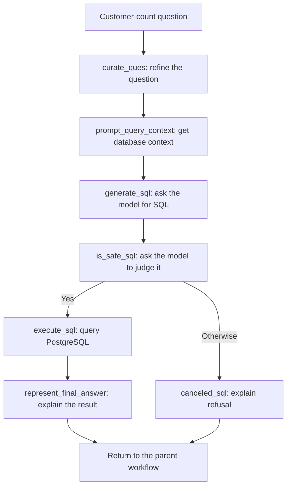

# SQL Agent: from a question to a database answer

Suppose you ask: **"How many customers do we have?"**

The SQL Agent tries to answer using the business records in PostgreSQL. SQL is the language it uses to ask that database a question. The model writes the query and explains the result; the database supplies the records.

This example assumes the connected database contains customer information and the router selects SQL. It does not assume a table named `customers` or invent a customer count.

Start with the [backend overview](BACKEND_OVERVIEW.md) if the shared request flow is new to you.

## How the question reaches SQL

React sends the question to `POST /api/assistant`. The API calls `run_request()`, and the parent router classifies the request. For `sql`, its `sql_node()` passes the question and initial state to the SQL graph.

The graph's state is its working notebook: it holds the question, database context, generated SQL, safety decision, result, and answer. Its model is `AgentSchema` in [state.py](../src/data_agent/agents/state.py).

See [router.py](../src/data_agent/agents/router.py) for delegation and [sql.py](../src/data_agent/agents/sql.py) for all the following nodes, defined inside `build_sql_graph()`.

## The actual steps

### 1. Refine the question: `curate_ques`

The first model call asks it to "curate" the question: prepare a clearer version for the following steps. The result is saved as `curated_ques` and added to the child workflow's messages.

The implementation uses `create_llm("low")`. The shared [llm.py](../src/data_agent/llm.py) factory selects the configured model; each node does not configure its own API key.

### 2. Learn what is in the database: `prompt_query_context`

The model needs to know which tables and columns actually exist. Otherwise, it could guess a table name that the database does not recognize.

`DatabaseService.schema_detail("public")` collects table names, column names and types, and up to five sample rows per table. This description of the database's structure is its **schema context**.

The node combines that context with the refined question in a prompt. It asks for PostgreSQL SQL only and asks the model to limit output to ten rows unless the user requests a specific number. That row limit is a prompt instruction, not a limit enforced by Python. A count query can return one row containing a total; ten returned rows does not mean only ten customers are counted.

Database settings come from `DB_HOST`, `DB_PORT`, `DB_DATABASE`, `DB_USERNAME`, and `DB_PASSWORD` through [config.py](../src/data_agent/config.py). Schema reading lives in [database.py](../src/data_agent/services/database.py).

### 3. Write the query: `generate_sql`

The node sends the prepared prompt to `create_llm("medium")` and stores the returned text in `generated_sql_query`.

For the customer-count question, the intended query counts the relevant records using the actual schema. There is no hardcoded customer query. The returned SQL text is passed onward without a SQL repair or retry loop.

### 4. Check the query: `is_safe_sql`

A second model call judges whether the SQL only retrieves data. The prompt tells it to reject commands that change records or database structure, such as `INSERT`, `DELETE`, or `DROP`.

The response uses `JudgeSchema`, with `answer` and `comments`. `is_safe_sql_edge()` sends a "Yes" decision to execution; anything else goes to `canceled_sql`, which explains the judge's refusal without running the query.

This is a **model-based check**, not a SQL parser or a database permission boundary. The SQL service does not establish a read-only transaction. The separate Data-page table browser does not provide additional protection for this agent's generated SQL. This remains a trusted/local application.

### 5. Ask PostgreSQL: `execute_sql`

`DatabaseService.execute_sql()` opens a cursor, passes the generated query to `cursor.execute()`, fetches the result rows, and commits. On its normal path it returns those rows as a string and closes the cursor and connection.

The graph stores that string in `sql_query_execution_result`. This is the evidence used to answer the question, rather than a number guessed by the model.

### 6. Explain the result: `represent_final_answer`

The final model call uses `create_llm("low")`. Its prompt includes the database result and refined question, asking for a concise, readable answer without SQL code. It also asks the model to explain when the result is empty or inconclusive.

The answer is stored in `final_answer` and added to the messages. For our example, a successful answer describes the actual count returned by PostgreSQL.

## What reaches the assistant?

The parent workflow receives the child state, but the API does not send that state to React. [assistant_response.py](../src/data_agent/services/assistant_response.py) prepares the public response:

- An accepted query with a usable result and answer returns `route: "sql"`, `status: "answered"`, and the answer.
- A "No" safety decision returns `status: "declined"` and the refusal explanation.
- Missing or invalid results follow the API error path instead of becoming a successful answer.

React displays the answer through the existing [AssistantMarkdown.tsx](../frontend/src/features/assistant/AssistantMarkdown.tsx) renderer.

## What happens when something fails?

The database service logs many query errors and returns `None`. The graph can still reach the answer-generation node, but the public response formatter rejects `None` or a blank execution result for an accepted SQL query. An empty result represented as `[]` is different: it is a valid execution result with no rows.

Other exceptions can propagate from connection, context, or model work. [api.py](../src/data_agent/api.py) converts failures into public error responses: recognized provider/database errors use 503, recognized timeouts use 504, and other unusable results use 500. Internal stack traces are not returned in those errors. Some database failures are caught internally, so they do not all become a 503.

There is no automatic SQL correction loop in this graph. The model-based check and final explanation can also be wrong; a completed request is not proof that the generated query matched the user's intent.

## Where to read next

The [generated SQL graph](../artifacts/graphs/sql_analyst_graph.png) shows the same node structure. Continue with the [ETL Agent guide](ETL_AGENT.md), or return to the [documentation index](README.md).
