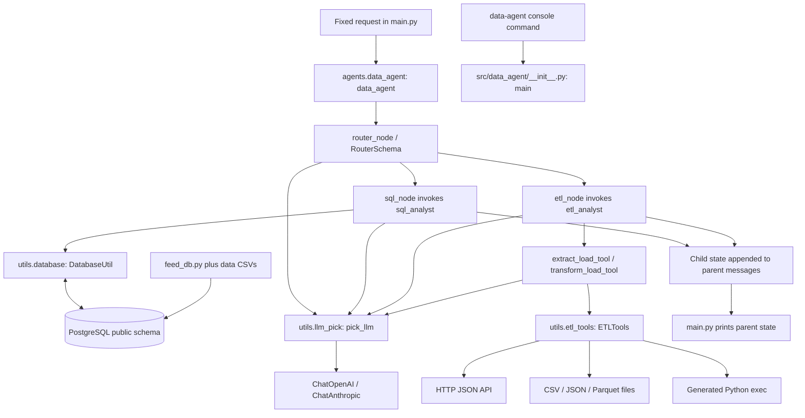
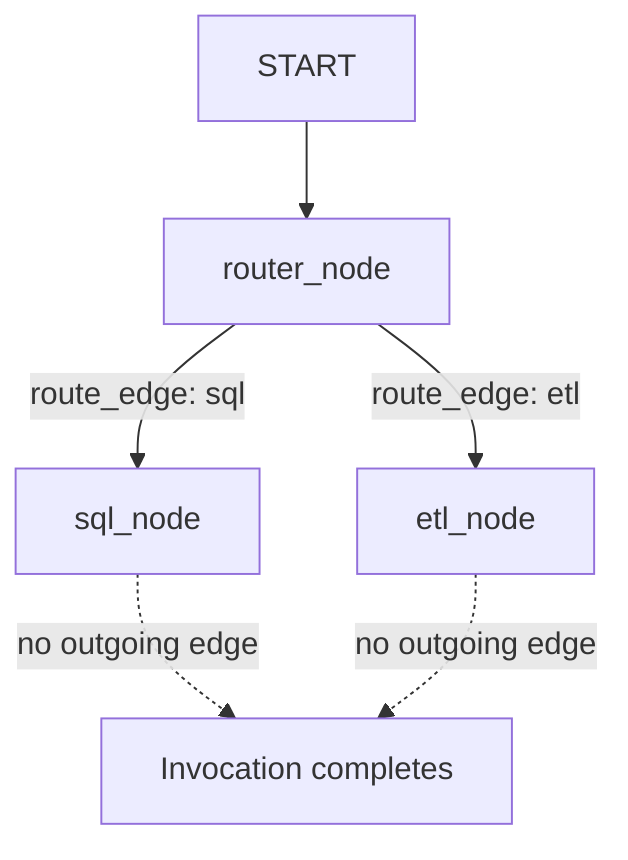
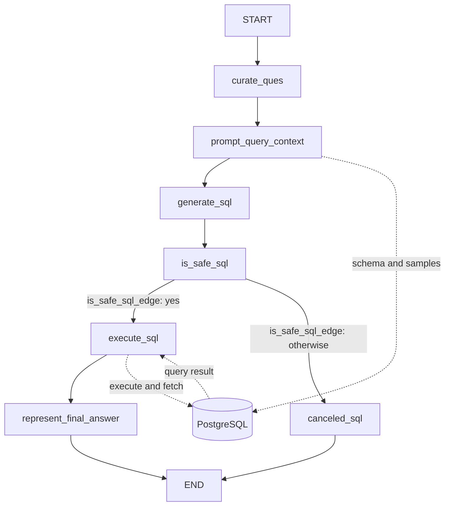
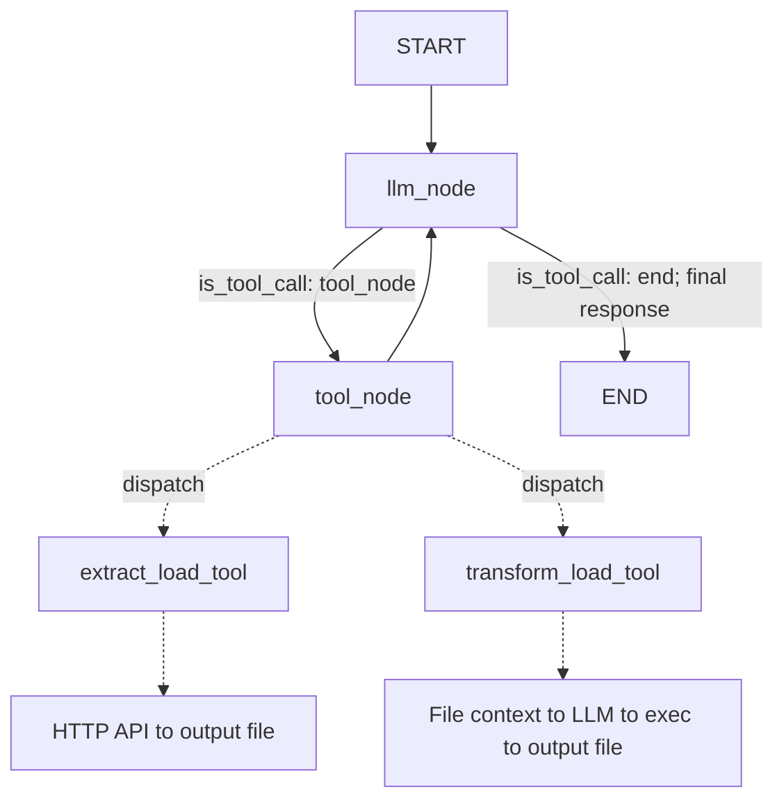

# Project Architecture

> [!NOTE]
> This document is retained as historical/learning material and describes an earlier project stage. Repository paths, dependency inventories, commands, and expected outputs may be outdated. For current structure, setup, and execution instructions, see the [root README](../../README.md).


Inspected: 25 September 2026. Scope: the current working tree at `D:\data-agent`, including untracked project files. Source code takes precedence over older documentation and saved graph images.

## 1. Project overview

**VERIFIED:** This is a Python data assistant with a LangGraph router that sends a natural-language request to either a PostgreSQL analysis workflow or an API/file ETL workflow. SQL nodes curate a question, inspect database context, generate and judge SQL, execute it, and compose an answer. ETL nodes let an LLM select tools for extracting API data or transforming files with generated Pandas code.

The main agent entry point is root `main.py`. It currently submits a fixed Pokémon API extraction request and prints the returned graph state; there is no interactive input loop, web server, or HTTP application endpoint. Major components communicate through Python imports, synchronous `.invoke()` calls, Pydantic state objects, LangChain messages, and direct utility method calls.

Technologies: Python 3.14+, LangGraph, LangChain, Pydantic, OpenAI and Anthropic client integrations, psycopg2/PostgreSQL, Requests, Pandas, and uv packaging. The installed `data-agent` console command is a separate starter greeting, not the agent workflow.

### Evidence labels

- **VERIFIED** — directly established by current source/configuration or inspected local library source.
- **INFERRED** — a likely implication, not independently demonstrated.
- **UNKNOWN** — not safely established from this repository.

Unless otherwise marked, file inventories, declarations, imports, and graph wiring below are **VERIFIED**. The execution walkthrough describes the wired paths, not a claim that an end-to-end run succeeds. No application imports, database queries, LLM calls, ETL operations, or dependency synchronization were performed for this documentation.

## 2. Actual directory structure

Generated/internal `.git/`, `.venv/`, Python caches, and IDE directories are excluded. Saved data and graph artifacts are included because they explain inputs and outputs.

```text
data-agent/
├── .env
├── .gitignore
├── .python-version
├── PROJECT_ARCHITECTURE.md
├── README.md
├── main.py
├── feed_db.py
├── pyproject.toml
├── uv.lock
├── data_agent_graph.png
├── sql_analyst_graph.png
├── test_schema_detail.txt
├── Models/
│   ├── __init__.py
│   └── schema.py
├── agents/
│   ├── __init__.py
│   ├── data_agent.py
│   ├── etl_analyst.py
│   ├── scratch.py
│   └── sql_analyst.py
├── utils/
│   ├── __init__.py
│   ├── database.py
│   ├── etl_tools.py
│   └── llm_pick.py
├── src/
│   └── data_agent/
│       └── __init__.py
├── data/
│   ├── payments.csv
│   ├── ratings.csv
│   ├── rides.csv
│   ├── users.csv
│   ├── vehicles.csv
│   ├── extract/
│   │   ├── .gitkeep
│   │   └── extracted_data.csv
│   └── transform/
│       └── .gitkeep
└── docs/
    ├── README.md
    ├── 01_PROJECT_STRUCTURE.md
    ├── 02_PYTHON_ENVIRONMENT.md
    ├── 03_UV_GUIDE.md
    ├── 04_PYTHON_RUNTIME.md
    ├── 05_HANDS_ON_EXERCISES.md
    └── GLOSSARY.md
```

The package directory is literally `Models` with an uppercase `M`. Imports use `Models.schema`. The IDE's separately opened `D:\AI_Data_Agent\Models\schema.py` is outside this repository and is not part of this architecture.

## 3. Directory responsibilities

| Directory | Purpose and contents | Used by |
| --- | --- | --- |
| Root | Script entry point, database seed script, project configuration, environment file, saved artifacts, documentation | Developer/runtime tooling |
| `agents/` | Router, SQL graph, ETL graph/tools, and an isolated scratch experiment | `main.py`; router imports both specialist modules |
| `Models/` | Pydantic graph-state and structured-response classes in `schema.py`; empty package initializer | All three agent modules and scratch experiment |
| `utils/` | LLM factory, PostgreSQL access, API/file/code-execution operations | Agent nodes and ETL tool wrappers |
| `src/` | Source root for the separately packaged starter application | Build configuration uses `uv_build` |
| `src/data_agent/` | Contains the greeting function targeted by the console script | `data-agent = "data_agent:main"` |
| `data/` | Five ride-service seed CSVs | `feed_db.py` |
| `data/extract/` | Existing extraction CSV and directory placeholder | ETL extraction example writes here |
| `data/transform/` | Placeholder for transformation outputs | Intended destination in the commented ETL example; actual path is tool input |
| `docs/` | Seven Python/environment/uv learning guides from the earlier starter stage | Human readers; no runtime imports |

The root agent packages and `src/data_agent` are separate code paths. There is no import connecting the packaged greeting to the agent graphs.

## 4. File-by-file architecture

### `main.py`

**Purpose:** Execute the combined data assistant example.

**Important contents:** A `__name__ == "__main__"` block invokes `data_agent` with `messages` containing one `HumanMessage` asking to extract `https://pokeapi.co/api/v2/pokemon` into `data/extract` as CSV, and `route_response` initialized to an empty string. It prints `response`. There is no defined `main()` function in this file.

**Imports:** `from agents.data_agent import data_agent` loads the compiled router graph and its dependency chain. `HumanMessage` comes from `langchain_core.messages`.

**Used by / role:** Direct script execution starts the agent application. Other project modules do not import this file.

### `agents/data_agent.py`

**Purpose:** Classify a request and synchronously delegate to one specialist graph.

**Important contents:** `router_node`, `etl_node`, `sql_node`, `route_edge`; module-level `llm`, `llm_router`, `data_agent_graph`, and compiled `data_agent`. A direct-execution block repeats the extraction example.

**Imports:** `pick_llm` from `utils.llm_pick` creates the router model. `RouterSchema` and `DataAgentSchema` from `Models.schema` define routing output and parent state. `etl_analyst` and `sql_analyst` are compiled graphs imported from their specialist modules. The earlier `from agents import sql_analyst` imports the module, but the later `from agents.sql_analyst import sql_analyst` rebinds that name to the compiled graph. Imported `ETLTools`, several message types, `tool`, and `ChatAnthropic` are not directly used here.

**Used by / role:** `main.py` invokes exported `data_agent`. `router_node` sends the last message content to `llm_router`, stores only its `answer`, and discards classification comments. Specialist nodes invoke child graphs with new inputs, append each whole returned state dictionary to parent `messages`, and return the parent state.

**Import-time behavior:** Adds the repository root to `sys.path`, loads both specialists, creates clients, compiles the parent graph, renders a Mermaid PNG through `IPython.display.Image`, and writes `data_agent_graph.png`. The image block is outside the main guard despite its “Optional” comment.

### `agents/sql_analyst.py`

**Purpose:** Define a question-to-SQL workflow.

**Important contents:** Seven node functions, routing function `is_safe_sql_edge`, builder `sql_agent_graph`, and compiled `sql_analyst`. Node names and state access are detailed below.

**Imports:** `pick_llm` supplies model clients; `DatabaseUtil` supplies schema inspection and SQL execution; `AgentSchema` defines graph state; `JudgeSchema` specifies the judge response. LangChain supplies `HumanMessage`/`AIMessage`, and LangGraph supplies `StateGraph`, `START`, and `END`.

**Used by / role:** `agents.data_agent.sql_node` invokes the compiled graph. It creates separate database utility instances for context inspection and query execution. It does not expose LangChain tools or use an LLM tool-call loop.

**Execution behavior:** Importing the module imports `utils.database`, whose top-level code accesses PostgreSQL. Direct execution of this file renders `sql_analyst_graph.png`; it does not invoke the SQL workflow with a question.

### `agents/etl_analyst.py`

**Purpose:** Define a tool-using ETL assistant and its tool wrappers.

**Important contents:** `extract_load_tool`, `transform_load_tool`, list `tools`, model `llm`, tool-bound model `llm_bind`, node functions `llm_node`/`tool_node`, routing function `is_tool_call`, builder `etl_analyst_graph`, and compiled `etl_analyst`.

**Imports:** `ETLTools` from `utils.etl_tools` performs IO and code execution. `pick_llm` creates both the tool-selecting model and the transformation-code model. `ETLAgentSchema` defines state. LangChain's `@tool` exposes callable schemas; `ToolMessage` associates observations with tool-call IDs.

**Used by / role:** `agents.data_agent.etl_node` invokes this graph. `tool_node` dispatches calls by their declared tool names using `.invoke(tool_call['args'])`. The direct-execution block renders `etl_analyst_graph.png` and invokes/prints the extraction example. That PNG is a possible output, not an existing file in the inspected tree.

`llm_node` interpolates the entire message list into a string prompt. It does not pass the list directly as a native chat history. `transform_load_tool` prompts another model for Pandas code, strips code-fence characters with string operations, calls `ETLTools.execute_code`, and returns a status string containing generated code and execution results. `output_format` appears in its final status message but is not interpolated into the code-generation prompt.

### `agents/scratch.py`

**Purpose:** Incomplete standalone SQL-judge experiment.

**Important contents:** Top-level `pick_llm("medium")`, `llm.with_structured_output(JudgeSchema)`, and a prompt referencing `sql_query`, which is not defined in this file. There are no functions or graph definitions.

**Imports:** `pick_llm`, `AgentSchema`, and `JudgeSchema`; only the judge schema is used. `HumanMessage` is unused.

**Used by / role:** No project module imports it. It is outside normal execution and is not a runnable successful judge example as written.

### `Models/schema.py`

**Purpose:** Define graph state and constrained LLM response shapes.

**Important contents:** `AgentSchema`, `JudgeSchema`, `ETLAgentSchema`, `RouterSchema`, and `DataAgentSchema`. All inherit Pydantic `BaseModel`; all declared fields use `Field(...)` and are required.

**Imports:** No local imports. `Annotated`, `Literal`, `operator.add`, and Pydantic establish field types, allowed values, and list reducers.

**Used by / role:** Agent modules use these classes as state contracts or `.with_structured_output(...)` response contracts. Complete field descriptions are in section 7.

### `utils/llm_pick.py`

**Purpose:** Central LLM client factory.

**Important contents:** `pick_llm(level)` returns a client or raises `ValueError`; module-level `load_dotenv()` loads environment settings. The direct-execution block invokes the low-level model with a geography question.

**Imports:** No local imports; uses `ChatOpenAI`, `ChatAnthropic`, and `dotenv.load_dotenv`.

**Used by / role:** All specialist/router agents and `agents/scratch.py`. Actual branch conditions and model strings are documented in section 11, including the unreachable medium/high branches.

### `utils/database.py`

**Purpose:** Connect to PostgreSQL, build textual schema context, and execute SQL.

**Important contents:** `DatabaseUtil.__init__(db_config)` calls `psycopg2.connect(**db_config)`, printing connection errors and setting `self.connection = None` on failure. `schema_detail(schema_name)` queries `information_schema.tables`, fetches column names/types, samples up to five rows per table, and returns formatted text. `execute_sql(query)` executes the query, fetches all rows, commits, and returns `str(result)`; its exception branch returns `None`. Both methods attempt to close their cursor and connection.

**Imports:** No project-local imports; uses `psycopg2`.

**Used by / role:** SQL nodes `prompt_query_context` and `execute_sql`. Connections are created per utility instance, not pooled or shared between these nodes.

**Import-time behavior:** Unguarded example code constructs a connection using hardcoded settings, calls `schema_detail("public")`, and writes `test_schema_detail.txt`. Credentials are intentionally not reproduced here. This executes even when another module merely imports `DatabaseUtil`.

**Current error handling:** `schema_detail` calls `connection.cursor()` before entering `try` and before checking for `None`. `execute_sql` creates its cursor inside `try` without initializing it first; failure before assignment can cause `finally` to raise `UnboundLocalError`. These are descriptions of the current file, not earlier versions.

### `utils/etl_tools.py`

**Purpose:** Implement ETL operations independently of graph wiring.

**Important contents:** Class `ETLTools` has an empty initializer and three methods:

- `extract_load(url, output_folder, format)` resolves a relative output folder against the repository root, performs `requests.get`, checks status, reads JSON, normalizes `data['results']`, and writes `extracted_data.<format>` as CSV, newline-delimited JSON, or Parquet. It creates the folder and returns a status string. It handles Requests exceptions, but not every JSON, shape, filesystem, or Pandas error. It does not follow API pagination or specify a request timeout.
- `transform_load_context(file_path)` reads CSV, line-delimited JSON, or Parquet and returns the first three rows as a string; unsupported extensions return a message. The supplied path is used directly.
- `execute_code(code)` runs Python `exec(code)` in the current process and returns a success/error string. There is no sandbox or validation layer in this implementation.

**Imports:** No local imports; uses Requests and Pandas plus `os` for paths.

**Used by / role:** Both ETL tool wrappers. The guarded direct-execution example reads a hardcoded file path under `C:\Data_Agent`; it is not the main application entry point.

### `feed_db.py`

**Purpose:** Standalone PostgreSQL schema creation and CSV reload script, separate from the agent request path.

**Important contents:** `DB_CONFIG`, `CSV_DIR = "data"`, connection/cursor, `create_tables_sql`, `load_csv(table_name, csv_file, columns)`, and a verification loop. It creates five tables and indexes, executes an active `TRUNCATE ... CASCADE`, loads CSVs with `cursor.copy_expert`, prints row counts, commits, and closes resources.

**Imports:** No project-local imports. Uses psycopg2 and `psycopg2.sql.Identifier`/`SQL` to construct COPY identifiers; calls `load_dotenv()` itself. The standard-library `csv` import is unused.

**Used by / role:** Invoked manually, not imported by agents. The whole script executes at module level. The truncation is active even though nearby comments describe clearing as optional. Relative CSV paths require running from the project root.

### Package initializer files

#### `agents/__init__.py`

**Purpose:** Empty initializer for the agent package. **Contents/imports:** None. **Used by / role:** Package imports such as `agents.data_agent`; no service registration or initialization logic.

#### `Models/__init__.py`

**Purpose:** Empty initializer for the schema package. **Contents/imports:** None. **Used by / role:** Imports of `Models.schema`.

#### `utils/__init__.py`

**Purpose:** Empty initializer for utilities. **Contents/imports:** None. **Used by / role:** Imports of database, ETL, and LLM utility modules.

#### `src/data_agent/__init__.py`

**Purpose:** Packaged starter command implementation. **Important contents:** `main() -> None` prints `Hello from data-agent!`. **Imports:** None. **Used by / role:** The console script configured in `pyproject.toml`; it does not call root `main.py` or any agent.

### Configuration and root documentation

#### `pyproject.toml`

**Purpose:** Distribution metadata, dependencies, build backend, and command mapping. **Contents:** Project `data-agent`, version `0.1.0`, Python `>=3.14`, nine runtime requirements, console script `data-agent = "data_agent:main"`, build backend `uv_build` with requirement `>=0.12.17,<0.13.0`. **Used by / role:** Packaging and uv; not imported by application code. No test/lint configuration or dependency groups are declared.

#### `uv.lock`

**Purpose:** Resolved dependency graph. **Contents:** Lock format version 1, revision 3, Python requirement `>=3.14`, platform resolution markers, local project and transitive package records. **Used by / role:** uv environment resolution/synchronization, not runtime application state. It includes `pydantic`, `python-dotenv`, and `requests` transitively; neither `pyarrow` nor `fastparquet` is present.

#### `.python-version`

**Purpose:** Requests Python `3.14` from compatible tooling. **Used by / role:** Interpreter selection; not application configuration or a guarantee about the installed interpreter.

#### `.env`

**Purpose:** Local provider/database settings. **Contents:** Variable names observed: `OPENAI_API_KEY`, `DB_HOST`, `DB_PORT`, `DB_DATABASE`, `DB_USERNAME`, `DB_PASSWORD`. Values are omitted. **Used by / role:** Loaded by `utils.llm_pick` and `feed_db.py`. No `ANTHROPIC_API_KEY` entry was observed; whether it exists in the launching process environment is **UNKNOWN**.

#### `.gitignore`

**Purpose:** Excludes `.env`/`.env.*` except an optional `.env.example`, virtual environments, Python caches, IDE files, and OS artifacts. **Used by / role:** Git only. No `.env.example` currently exists.

#### `README.md`

**Purpose:** Root readme referenced by project metadata. **Contents:** Empty. **Used by / role:** Packaging metadata; supplies no startup instructions.

#### `PROJECT_ARCHITECTURE.md`

**Purpose:** This current architecture reference. **Used by / role:** Developers; no runtime effect.

### Data and saved artifacts

These files have no Python imports, classes, or functions. Their roles are:

| File | Purpose / important contents | Used by |
| --- | --- | --- |
| `data/users.csv` | 10,000 data rows; user identity/profile, user type, signup and active status columns | `feed_db.load_csv` → `public.users` |
| `data/vehicles.csv` | 3,000 rows; vehicle identity, driver link and vehicle attributes | `feed_db.load_csv` → `public.vehicles` |
| `data/rides.csv` | 20,000 rows; rider/driver links, timestamps, coordinates, distance, fare and status | `feed_db.load_csv` → `public.rides` |
| `data/payments.csv` | 16,073 rows; ride/user links, amount, payment method/status and transaction details | `feed_db.load_csv` → `public.payments` |
| `data/ratings.csv` | 12,000 rows; ride/rider/driver links, rating, comment and timestamp | `feed_db.load_csv` → `public.ratings` |
| `data/extract/extracted_data.csv` | Existing extraction output with 20 rows and `name`, `url` columns | Fits the extraction example; not automatically read by startup |
| `data/extract/.gitkeep` | Empty directory placeholder | Git/developers; no runtime role |
| `data/transform/.gitkeep` | Empty directory placeholder | Git/developers; no runtime role |
| `test_schema_detail.txt` | Saved `public` schema context for the five seed tables, including sample rows | Written by unguarded database example; agents build context afresh rather than reading it |
| `data_agent_graph.png` | Saved parent graph image; producer exists in `agents/data_agent.py` | Human inspection; not runtime input |
| `sql_analyst_graph.png` | Saved SQL graph image; producer exists in `agents/sql_analyst.py` | Human inspection; not runtime input |

CSV row counts exclude headers. **UNKNOWN:** Whether saved images exactly match current graph definitions or saved artifacts came from the current revision. Their existence does not prove today's workflow succeeds.

### Existing learning guides

All seven files below are Markdown for readers, have no Python imports, and are linked through `docs/README.md`. They describe the earlier starter inspected on 20 September 2026. Their claims that root `main.py` is empty, runtime dependencies are absent, or Git metadata is absent do not match this working tree.

| File | Purpose and important contents | Application role |
| --- | --- | --- |
| `docs/README.md` | Reading order, environment diagram, evidence conventions and original scope | Learning-guide index |
| `docs/01_PROJECT_STRUCTURE.md` | Earlier inventory, ownership, project TOML/lock and starter entry point | Historical structure explanation |
| `docs/02_PYTHON_ENVIRONMENT.md` | Interpreter, `.venv`, site-packages, PATH and environment settings | Python environment reference |
| `docs/03_UV_GUIDE.md` | uv/pip roles, init/sync/run/add and dependency workflow | Tooling reference |
| `docs/04_PYTHON_RUNTIME.md` | Script versus command execution, imports, package installation | Runtime learning guide |
| `docs/05_HANDS_ON_EXERCISES.md` | Inspection and optional dependency exercises | Manual learning exercises, not automated tests |
| `docs/GLOSSARY.md` | Python/runtime/tooling/Git terminology | Vocabulary reference |

## 5. Agent architecture

Here an “agent” is a compiled graph, not a class with an agent base type. A node is a Python function registered in that graph. A tool is a callable exposed to an LLM through LangChain's `@tool` and `.bind_tools()`.

| Agent / exported object | File | Responsibility | Input → output | LLM configuration | Tools | Caller / normally after |
| --- | --- | --- | --- | --- | --- | --- |
| Data router / `data_agent` | `agents/data_agent.py` | Select SQL or ETL and invoke specialist | `DataAgentSchema` input → parent state containing route and child result | `pick_llm("claude")`, structured `RouterSchema` | None | Root `main.py` or own main guard → printed state |
| SQL analyst / `sql_analyst` | `agents/sql_analyst.py` | Question → context → judged SQL → result/answer | `AgentSchema` input → SQL state with `final_answer` on completed path | `low` for curation/answer; requested `medium` for generation/judgment | No bound tools; direct `DatabaseUtil` calls | Parent `sql_node` → append child result, parent quiesces |
| ETL analyst / `etl_analyst` | `agents/etl_analyst.py` | Select and execute extraction/transformation tools | `ETLAgentSchema` input → state with AI/tool messages | `claude` for tool selection and transformation code | `extract_load_tool`, `transform_load_tool` | Parent `etl_node` or own example → parent appends child result or example prints |

### ETL tool contracts

| Tool | Inputs | Work performed | Output |
| --- | --- | --- | --- |
| `extract_load_tool` | `url: str`, `output_folder: str`, `format: str` | Calls `ETLTools.extract_load` | Extraction success/failure string |
| `transform_load_tool` | `input_file_path: str`, `output_folder: str`, `output_format: str`, `user_question: str` | Reads three-row context; asks Claude for Pandas code; executes it | Status text, code, execution status |

Tools do not read graph state directly. Their arguments come from model tool calls. `tool_node` writes returned observations into state as `ToolMessage` objects. Multiple calls in one response are executed sequentially by its `for` loop.

## 6. StateGraph / workflow architecture

All three builders call `.compile()` without an explicit checkpointer, persistent store, interrupt policy, or application retry policy. Calls are synchronous `.invoke()`; no streaming or async entry point is present.

### Parent graph

Builder: `data_agent_graph = StateGraph(DataAgentSchema)`. Export: `data_agent`.

| Graph node | Python function | Reads from state | Writes to state | Next step |
| --- | --- | --- | --- | --- |
| `router_node` | `router_node` | `messages[-1].content` | `route_response` | `route_edge` chooses `sql_node` or `etl_node` |
| `etl_node` | `etl_node` | `messages[-1].content`, `messages` | `messages` with child ETL state appended | No outgoing edge registered |
| `sql_node` | `sql_node` | `messages[-1].content`, `messages` | `messages` with child SQL state appended | No outgoing edge registered |

`START → router_node` is explicit. `route_edge` maps `sql` to `sql_node`, `etl` to `etl_node`, and raises `ValueError` for anything else. The parent imports `END` but never adds edges to it. **INFERRED:** After a specialist returns, the parent finishes because there are no scheduled successor nodes; this is not an explicit `add_edge(..., END)` in source.

### SQL graph

Builder: `sql_agent_graph = StateGraph(AgentSchema)`. Export: `sql_analyst`.

| Graph node | Python function | Reads from state | Writes to state | Next step |
| --- | --- | --- | --- | --- |
| `curate_ques` | `curate_ques` | `user_question`, `messages` | `curated_ques`, `messages` | `prompt_query_context` |
| `prompt_query_context` | `prompt_query_context` | `curated_ques` | `prompt_query_context` | `generate_sql` |
| `generate_sql` | `generate_sql` | `prompt_query_context` | `generated_sql_query` | `is_safe_sql` |
| `is_safe_sql` | `is_safe_sql` | `generated_sql_query` | `is_safe`, `comments` | `is_safe_sql_edge` |
| `canceled_sql` | `canceled_sql` | `comments`, `messages` | `final_answer`, `messages` | Explicit `END` |
| `execute_sql` | `execute_sql` | `generated_sql_query` | Attempts `sql_query_execution_result` (not declared) | `represent_final_answer` |
| `represent_final_answer` | `represent_final_answer` | `sql_query_execution_result` (not declared), `curated_ques`, `messages` | `final_answer`, `messages` | Explicit `END` |

`START → curate_ques` is explicit. `is_safe_sql_edge` returns `execute_sql` when `state.is_safe.lower() == "yes"`; otherwise it returns `canceled_sql`. Both route names map to identically named nodes.

SQL node registration uses `add_node(function, name="...")`. The inspected local LangGraph implementation derives names from the function's `__name__` when a callable is supplied; those function names match the edge names. A graph node called `prompt_query_context`, a Python function called `prompt_query_context`, and a state field called `prompt_query_context` are three separate objects despite sharing spelling.

### ETL graph

Builder: `etl_analyst_graph = StateGraph(ETLAgentSchema)`. Export: `etl_analyst`.

| Graph node | Python function | Reads from state | Writes to state | Next step |
| --- | --- | --- | --- | --- |
| `llm_node` | `llm_node` | `messages` | `messages` with model response appended | `is_tool_call` chooses tool node or `END` |
| `tool_node` | `tool_node` | Last message's `tool_calls`, `messages` | `messages` with tool observations appended | `llm_node` |

`START → llm_node`. `is_tool_call` returns `tool_node` for nonempty tool calls or the route label `end`, mapped to LangGraph `END`. `tool_node → llm_node` closes the loop. There is no separate final-answer node in ETL: the final model response without tool calls ends the graph. No application-specific tool-round limit is configured.

## 7. State schemas and ownership

Every field below is **required**, with no default, because `Field(...)` uses an ellipsis. Empty strings in caller dictionaries are caller-supplied initial values, not model defaults. Pydantic state objects are accessed by attributes inside nodes; `.invoke()` is supplied dictionaries and returns graph output used as a dictionary by the enclosing flow.

### `AgentSchema`

| Field | Declared type | Creator/updater | Consumer | Purpose |
| --- | --- | --- | --- | --- |
| `messages` | `Annotated[list, add]` | Parent initializes `[]`; curation, cancellation and answer nodes append | Those same nodes; returned state | SQL message history |
| `user_question` | `str` | Parent `sql_node` | `curate_ques` | Original request |
| `curated_ques` | `str` | Parent initializes empty; `curate_ques` updates | Context and answer nodes | Rewritten request |
| `prompt_query_context` | `str` | Parent initializes empty; same-named node updates | `generate_sql` | SQL instructions plus live schema/sample rows |
| `generated_sql_query` | `str` | Parent initializes empty; `generate_sql` updates | Judge and execution nodes | SQL text |
| `is_safe` | `Literal["Yes", "No"]` | Parent initializes `"No"`; judge updates | `is_safe_sql_edge` | Routing decision |
| `comments` | `str` | Parent initializes empty; judge updates | `canceled_sql` | Judge explanation |
| `sql_query_exection_result` | `str` | No matching initializer or writer in current caller/nodes | No matching reader | Declared result field has a spelling mismatch |
| `final_answer` | `str` | Parent initializes empty; cancellation or answer node updates | Returned child state | User-facing SQL explanation |

The actual schema spells `sql_query_exection_result` without `ut` in “execution”. Parent input and SQL execution/answer functions instead use `sql_query_execution_result`. **VERIFIED:** These are different names. **INFERRED:** The missing required field blocks state validation; even if supplied separately, assignment/read of the other name would remain inconsistent with the Pydantic schema.

### `DataAgentSchema`

| Field | Type | Creator/updater | Consumer / purpose |
| --- | --- | --- | --- |
| `messages` | `Annotated[list, add]` | Entry initializes human message; specialist nodes append whole child results | Router/specialist nodes use latest `.content`; final output includes nested child state |
| `route_response` | `str` | Entry initializes `""`; router assigns response `answer` | `route_edge` chooses specialist |

Although the router's response schema constrains answers, parent `route_response` itself is a plain string. A child state dictionary appended to `messages` is not an `AIMessage`; the unparameterized `list` annotation does not restrict element types. The current graph has no subsequent router pass over that dictionary.

### `ETLAgentSchema`

| Field | Type | Creator/updater | Consumer / purpose |
| --- | --- | --- | --- |
| `messages` | `Annotated[list, add]` | Caller supplies human message; `llm_node` appends AI response; `tool_node` appends `ToolMessage`s | LLM prompt, tool dispatch and termination routing |

### Structured LLM response schemas

| Class | Required field | Type | Producer / consumer |
| --- | --- | --- | --- |
| `JudgeSchema` | `answer` | `Literal["Yes", "No"]` | Intended structured judge response → `state.is_safe` |
| `JudgeSchema` | `comments` | `str` | Intended structured judge response → `state.comments` |
| `RouterSchema` | `answer` | `Literal["sql", "etl"]` | Router model → `state.route_response` |
| `RouterSchema` | `comments` | `str` | Router model generates it; parent discards it |

`Field` descriptions supply schema metadata to Pydantic/structured-output integration. `Literal` restricts accepted values. These response models are not graph state classes.

### Reducers and persistence

`Annotated[list, add]` tells LangGraph to merge message updates by list concatenation using `operator.add`; it is not LangGraph's message-ID-aware `add_messages` reducer. Other fields have no custom reducer and use ordinary state updates.

Nodes mutate and return the entire Pydantic state, commonly setting `state.messages = state.messages + [new_item]`. **INFERRED:** Returning already accumulated history to an additive channel can duplicate prior messages when LangGraph merges updates. This is especially relevant to repeated ETL tool rounds. The declarations do not establish clean append-only history semantics.

No persistent conversation database, checkpoint configuration, session/thread ID, or cross-invocation memory store is configured. PostgreSQL contains business data, not saved graph state. Files persist ETL outputs; graph state lives within the invocation.

## 8. Complete execution flow

### Startup before the first request

1. Python executes root `main.py` and imports `agents.data_agent` before reaching its main guard.
2. The parent module imports `agents.sql_analyst`. That module imports `utils.llm_pick`, which calls `load_dotenv()`, then `utils.database`, whose unguarded example connects, reads schema/sample data, and writes `test_schema_detail.txt`.
3. SQL graph definitions are registered and compiled if imports finish successfully.
4. Importing `agents.etl_analyst` creates the Claude client, binds its two tools, and compiles the ETL graph.
5. The parent creates a Claude structured router, compiles its graph, and renders/writes `data_agent_graph.png`.
6. Root `main.py` invokes the graph using its hardcoded `HumanMessage` and empty routing field.

Importing Python modules can execute top-level statements; it is not merely declaring symbols. Here this makes database access and image generation part of startup even for an ETL-only request.

### Parent routing

1. `agents.data_agent.router_node` sends the last message text to `llm_router.invoke`.
2. The `RouterSchema` response is converted through `.model_dump()`; only `answer` becomes `route_response`.
3. `route_edge` chooses a specialist. There is no deterministic keyword router and no dedicated classification system prompt beyond the schema metadata and incoming message.

### ETL branch

1. `etl_node` supplies a new `HumanMessage` to `etl_analyst.invoke`.
2. `agents.etl_analyst.llm_node` builds a string prompt from history and invokes `llm_bind`.
3. `is_tool_call` ends the graph if the response has no tool calls, or schedules `tool_node`.
4. `tool_node` dispatches each tool call. Extraction performs one HTTP request and saves normalized `results`; transformation reads file context, generates Python, and executes it.
5. Tool observations are appended as `ToolMessage`s. The graph returns to `llm_node` until a response has no tool calls.
6. Parent `etl_node` appends the complete child graph result to its own message list. The parent has no further registered successor. Root `main.py` prints the whole parent result, not only the last answer's text.

### SQL branch as wired

1. `sql_node` constructs initial SQL state from the last parent message and invokes `sql_analyst`. The result-field mismatch described above affects this handoff.
2. `curate_ques` asks a low-level model to rewrite the question, storing its text and a `HumanMessage`.
3. `prompt_query_context` creates `DatabaseUtil` from environment variables and obtains live `public` schema details plus up to five sample rows per table. It builds instructions requesting executable PostgreSQL SQL and a default limit of 10 rows.
4. `generate_sql` requests a medium-level model and stores its output content directly. There is no SQL code-fence cleanup or parser.
5. `is_safe_sql` requests a structured judgment prohibiting data/schema modification. The current client-method spelling prevents this intended call; see section 14.
6. `is_safe_sql_edge` routes a positive decision to `execute_sql`, otherwise to `canceled_sql`.
7. Cancellation constructs a final explanation and ends. Execution creates a fresh database connection, executes/fetches/commits, and attempts to store the result under the mismatched field name.
8. `represent_final_answer` asks a low-level model to explain the result, writes `final_answer`, appends an `AIMessage`, and ends.
9. Parent `sql_node` appends the full returned SQL state; root `main.py` prints the parent state.

## 9. High-level architecture diagram

Solid arrows show declared call/data relationships, not proof of a successful run.



## 10. Detailed workflow diagrams

Node labels below use the exact graph node names. Separate diagrams avoid conflating parent and child state. Dotted parent completion arrows describe the absence of successors rather than explicit edges.

### Parent



### SQL child



### ETL child



The database/tool boxes are operations called inside nodes, not additional registered graph nodes.

## 11. Module dependencies and LLM integration

### Local import map

```text
main.py
└── agents.data_agent → compiled data_agent
    ├── agents.sql_analyst → module, then compiled sql_analyst
    │   ├── utils.llm_pick → pick_llm
    │   ├── utils.database → DatabaseUtil
    │   └── Models.schema → AgentSchema, JudgeSchema
    ├── agents.etl_analyst → compiled etl_analyst
    │   ├── utils.llm_pick → pick_llm
    │   ├── utils.etl_tools → ETLTools
    │   └── Models.schema → ETLAgentSchema
    ├── utils.llm_pick → pick_llm
    ├── utils.etl_tools → ETLTools (unused import here)
    └── Models.schema → RouterSchema, DataAgentSchema

agents.scratch (not imported by application)
├── utils.llm_pick → pick_llm
└── Models.schema → AgentSchema, JudgeSchema

feed_db.py → external libraries only
data-agent console script → src/data_agent/__init__.py:main
```

Agent modules append the parent directory to `sys.path` using their own `__file__`. This supports imports of root-level `utils`, `Models`, and `agents` when running those files directly. It is an explicit path adjustment, not a dependency-injection container. No local circular import chain was found.

### LLM factory and actual branches

| Requested level | Code configuration | Callers | Current behavior |
| --- | --- | --- | --- |
| `low` | `ChatOpenAI(model_name="gpt-5.6-luna", temperature=0, model_kwargs={"reasoning_effort":"none"})` | SQL curation and final answer; standalone factory example | Branch checks `level.lower()` |
| `medium` | Declared `gpt-5.6-terra` with same temperature/model kwargs | SQL generation, safety judge, scratch | Branch compares `level.lower` method to a string, so does not match |
| `high` | Declared `gpt-5.6-sol` with same temperature/model kwargs | No project caller | Same method-versus-string comparison; does not match |
| `claude` | `ChatAnthropic(model_name="claude-sonnet-5")` | Router, ETL loop, transformation code generation | Branch checks `level.lower()`; model name reproduced exactly as written |

**VERIFIED:** Medium/high requests reach the unsupported-level `ValueError` rather than their configured constructors. **UNKNOWN:** Whether any configured model identifier, including the literal `claude-sonnet-5`, is accepted by the user's provider/account. This documentation records code strings without asserting provider availability.

### Environment flow

```text
.env → utils.llm_pick module-level load_dotenv()
     → process environment → ChatOpenAI / ChatAnthropic client configuration
                         └→ SQL node os.environ[...] database settings

.env → feed_db.py load_dotenv() → DB_CONFIG → psycopg2.connect
```

The factory does not pass API keys explicitly. Inspected local client code recognizes `OPENAI_API_KEY` and `ANTHROPIC_API_KEY`. Only the OpenAI key name is present in this repository's `.env`; external process settings are **UNKNOWN**. No values are included here.

Prompts are passed synchronously to `.invoke()`. SQL uses response `.content` as strings stored in fields. The router uses `.with_structured_output(RouterSchema)` followed by `.model_dump()`. The judge attempts the differently spelled `.with_structured_output(JudgeSchema)`. ETL binds tools using `.bind_tools(tools)` and stores the response message with its `tool_calls`; the transformation tool uses `.content` as executable code.

SQL schema samples/query results and ETL preview rows are included in provider prompts. The code contains no redaction step before these prompt constructions.

## 12. Database architecture

Driver: `psycopg2` supplied by `psycopg2-binary`. There is no ORM or migration framework. `DatabaseUtil` is a small connection wrapper, and `feed_db.py` embeds DDL/COPY operations directly.

SQL nodes construct settings from `DB_HOST`, `DB_PORT`, `DB_USERNAME`, `DB_PASSWORD`, and `DB_DATABASE`; context uses the `database` connection argument, execution uses `dbname`. The utility's unguarded example uses a separate hardcoded configuration and does not read `.env` itself.

```text
SQL question
  → prompt_query_context → DatabaseUtil.schema_detail("public")
  → LLM-generated SQL
  → is_safe_sql (intended LLM judgment)
  → is_safe_sql_edge
      ├─ No → canceled_sql → final_answer
      └─ Yes → execute_sql → DatabaseUtil.execute_sql
                              → psycopg2 → PostgreSQL
                              → fetchall → str(list of row tuples)
                              → attempted sql_query_execution_result assignment
                              → represent_final_answer → final_answer
```

### Seeded relational model

| Table | Key relationships declared by `feed_db.py` |
| --- | --- |
| `public.users` | Primary key `user_id`; unique email |
| `public.vehicles` | Primary key `vehicle_id`; `driver_id → users.user_id`; unique license plate |
| `public.rides` | Primary key `ride_id`; rider and driver IDs reference users |
| `public.payments` | Primary key `payment_id`; ride and user references; unique transaction ID |
| `public.ratings` | Primary key `rating_id`; ride, rider and driver references; rating check from 1 to 5 |

The loader adds indexes on relevant foreign keys, ride request time/status, and rating driver ID. It loads users, vehicles, rides, payments, then ratings. **UNKNOWN:** Whether a running database currently contains this schema or matches the saved snapshot.

### Query boundaries and safety

The LLM judge is the only SQL safety gate defined in the graph. There is no SQL parser, read-only transaction setting, application-enforced row limit, or database-role restriction in the repository. The prompt's default 10-row limit is a generation instruction, not an enforced execution cap. **UNKNOWN:** Permissions of the actual database role.

`schema_detail` filters table names by schema but its column lookup filters only by table name, so identically named tables in different schemas can contaminate context. Its sample query interpolates identifiers directly. `execute_sql` executes received SQL without additional validation, uses `fetchall()`, commits, and closes the connection; errors may return `None` or be masked by cleanup failures.

## 13. External dependencies

The following are the actual direct requirements in `pyproject.toml`, not recommendations or verified installed versions.

| Dependency | Declared constraint | Purpose in this project |
| --- | --- | --- |
| `dotenv` | `>=0.9.9` | Provides dependency on `python-dotenv`; source imports `load_dotenv` for provider/DB configuration |
| `ipython` | `>=9.17.1` | Supplies `IPython.display.Image` for graph PNG handling; imported `display` is unused |
| `langchain` | `>=1.4.2` | Supplies `langchain.tools.tool` for ETL wrappers |
| `langchain-anthropic` | `>=1.7.4` | `ChatAnthropic` for routing, ETL tool selection and generated transformation code |
| `langchain-openai` | `>=1.6.2` | `ChatOpenAI` for SQL-oriented model choices |
| `langgraph` | `>=1.2.11` | State graphs, graph compilation, conditional routing and invocation |
| `pandas` | `>=3.0.6` | API result normalization and file reads/writes; available to generated transformation code |
| `psycopg2-binary` | `>=2.9.13` | PostgreSQL connections, schema discovery, SQL execution and COPY loading |
| `pydentic` | `>=0.0.1.dev3` | Declared dependency, but no project source imports it; not the `pydantic` library used for schemas |

Additional imported packages supplied transitively by the lock:

| Package | Verified use |
| --- | --- |
| `pydantic` | `BaseModel` and `Field` in `Models/schema.py`; locked separately from `pydentic` |
| `langchain-core` | Human/AI/tool messages and underlying model interfaces |
| `requests` | HTTP extraction in `utils/etl_tools.py`; not declared directly |
| `python-dotenv` | Actual dotenv-loading implementation |

Build-only dependency: `uv_build>=0.12.17,<0.13.0`. Parquet branches exist, but the lock has neither `pyarrow` nor `fastparquet`; **UNKNOWN:** Whether a usable Parquet engine is installed outside the declared environment. No dedicated automated test suite was found; `test_schema_detail.txt` is an output artifact, not a test.

## 14. Current implementation constraints

These findings belong to the documented architecture because they affect whether the declared paths execute. No fixes were applied.

| Evidence | Finding | Effect |
| --- | --- | --- |
| **VERIFIED** | `utils.database` performs DB IO and a file write at import time | An ETL request still has a startup database dependency |
| **VERIFIED** | Cursor initialization occurs before the guard in `schema_detail`; cleanup can reference an unassigned cursor in `execute_sql` | Connection failures can prevent import or hide the original error |
| **VERIFIED** | Required `sql_query_exection_result` differs from caller/node `sql_query_execution_result` | SQL state contract is inconsistent; validation/attribute failures are expected |
| **VERIFIED** | `pick_llm` compares `level.lower` rather than calling it in medium/high branches | SQL generation/judgment cannot obtain the requested medium client |
| **VERIFIED** | Judge uses `with_structured_output`; inspected LangChain interface defines `with_structured_output` | Judge integration has a method-name mismatch; scratch repeats it |
| **VERIFIED** | Literal Anthropic model string is `claude-sonnet-5`; no Anthropic key entry in `.env` | Provider acceptance and process-level credentials remain **UNKNOWN** |
| **VERIFIED** | Parent renders a PNG outside its main guard | Graph-image rendering/file-write failure can interrupt application startup |
| **VERIFIED** | Nodes return accumulated messages while using additive reducers | **INFERRED:** Earlier history can be duplicated |
| **VERIFIED** | Parent appends entire child states and prints full state | Output is nested workflow data, not a polished single-answer UI |
| **VERIFIED** | ETL reads only JSON `results` and does not paginate | Extraction supports that response shape rather than arbitrary APIs/all pages |
| **VERIFIED** | Transformation uses unrestricted `exec`; status says saved even if execution returns an error string | Generated code has process access, and the surrounding success wording is not reliable evidence of a saved file |
| **VERIFIED** | `feed_db.py` actively truncates data | It is a reload operation, not a harmless startup prerequisite |
| **VERIFIED** | Console command targets the greeting package | `uv run data-agent` does not start the assistant |

**UNKNOWN:** End-to-end success, current database availability, provider access, generated SQL correctness, generated transformation correctness, and whether prior artifact outputs came from this exact code revision.

## 15. Application startup

From the repository root, the source layout identifies this command for the combined assistant:

```powershell
uv run python main.py
```

This launches the root script, loads its import chain, builds graphs/clients, performs the import-time side effects described above, invokes the hardcoded extraction request, and prints returned state. It is the correct script target, but current implementation constraints mean successful completion is not established. uv may prepare/synchronize the project environment before launching Python; this command was documented, not executed during inspection.

With an already prepared virtual environment, the equivalent script target is:

```powershell
.\.venv\Scripts\python.exe main.py
```

Required resources depend on the path: provider credentials for clients, PostgreSQL access during current import-time initialization, environment DB variables for SQL nodes, and HTTP/filesystem access for extraction. Provider/model availability is not established by the lock file.

### Other actual entry points

| Command from project root | Actual behavior |
| --- | --- |
| `uv run data-agent` | Calls `src/data_agent/__init__.py:main`; prints greeting only |
| `uv run python agents/data_agent.py` | Builds parent/imports children, writes parent PNG, invokes same extraction example |
| `uv run python agents/etl_analyst.py` | Builds ETL graph, writes an ETL PNG, invokes/prints extraction example |
| `uv run python agents/sql_analyst.py` | Imports database utility, builds SQL graph, writes SQL PNG; does not submit a question |
| `uv run python feed_db.py` | Creates schema/tables/indexes, truncates and reloads five seed tables, prints counts, commits |
| `uv run python utils/database.py` | Runs unguarded schema snapshot example |
| `uv run python utils/llm_pick.py` | Calls low-level LLM with its example question |
| `uv run python utils/etl_tools.py` | Attempts the fixed-path three-row file preview example |

There is no interactive CLI argument parser or `input()` call. Changing the request currently means changing the caller-supplied message or invoking the compiled graph from Python. The parent passes only the latest message to each specialist, so it does not delegate the full conversation history.

## 16. Architecture summary

```text
Root main.py: fixed natural-language HumanMessage
  ↓
agents.data_agent.data_agent — DataAgentSchema
  ↓
router_node — Claude structured RouterSchema
  ├─ sql_node → sql_analyst — AgentSchema
  │              question curation → live PostgreSQL context
  │              → SQL generation → safety judgment
  │                 ├─ cancel → explanation
  │                 └─ execute → DB result → LLM answer
  │
  └─ etl_node → etl_analyst — ETLAgentSchema
                 llm_node ↔ tool_node
                   ├─ API JSON results → Pandas → file
                   └─ file preview → generated Pandas code → exec → file
                 → final model message without tool calls
  ↓
Full specialist state appended to parent messages
  ↓
main.py prints full parent state

Separate operations:
feed_db.py → creates and reloads PostgreSQL seed data
data-agent console command → starter greeting only
```

The central design is one router and two specialist state graphs sharing an LLM factory and utility modules. PostgreSQL serves the SQL branch, filesystem/API operations serve ETL, and Pydantic schemas define state and structured decisions. The current repository also contains concrete startup and state-contract mismatches; those are part of this verified snapshot rather than missing behavior assumed into existence.
